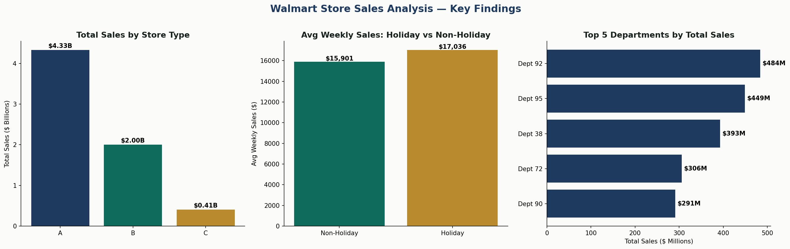

# Walmart Store Sales Analysis

A SQL analysis of Walmart's official store sales dataset, answering real business questions about store performance, holiday effects, and promotional impact using joins, CTEs, and window functions.



## Dataset

The **Walmart Recruiting — Store Sales Forecasting** dataset, released by Walmart via Kaggle for a real hiring competition. Covers 421,570 weekly sales records across 45 stores and 81 departments, from February 2010 to October 2012, plus store metadata (type, size) and weekly economic/promotional features (fuel price, CPI, unemployment, markdown promotions).

## Tools

SQLite · SQL (joins, CTEs, window functions: `LAG()`, `RANK()`) · Python/pandas (data loading)

## Business questions answered

All queries live in [`queries/business_questions.sql`](queries/business_questions.sql).

**Q1 — Which store type performs best, and does size explain it?** Type A stores (22 of the 45) generate $4.33B in total sales — more than double Type B ($2.0B) and over 10x Type C ($405M). Type A stores also average the largest size (182K sq ft vs 40K for Type C), so scale is clearly part of the story, but Type A's per-store average ($196.9M) still outpaces Type B's per-store average by a wider margin than the size difference alone would predict.

**Q2 — Do holiday weeks actually drive higher sales?** Yes — holiday weeks average $17,035 in weekly sales per store/department vs. $15,901 for non-holiday weeks, a real but modest ~7% lift. Holiday weeks are also a small minority of the dataset (29,661 of 421,570 records), so the effect is consistent but not dominant.

**Q3 — Top 10 store/department combinations by revenue.** Department 92 at Store 14 leads at $26.1M — and department 92 appears repeatedly across different stores in the top 10, suggesting it's a consistently strong department company-wide, not a one-store anomaly.

**Q4 — Month-over-month sales trend**, using `LAG()` to compare each month to the one before it. Sales swing significantly month to month — e.g. April 2010 jumped nearly $50M over March, then May dropped almost $45M — reflecting real seasonal retail volatility rather than a smooth trend.

**Q5 — Top 3 departments by sales within each store type**, using `RANK() OVER (PARTITION BY type)`. Department 92 is the #1 department in both Type A and Type C stores, and #1 in a different department (38) for Type B — showing store type meaningfully changes which departments matter most.

**Q6 — Does a markdown promotion actually lift sales?** Weeks with a Markdown1 promotion active averaged $16,215 vs. $15,851 without — a real but small ~2.3% lift, joining the sales table to the features table on store and date.

## Key takeaway

Store type (A/B/C) is the single strongest driver of sales performance in this dataset, more than holiday timing or markdown promotions individually. Department 92 stands out as a consistently top-performing department across multiple store types, which would be worth a follow-up investigation into what that department actually sells.

## How to run it

```bash
sqlite3 database/walmart.db < queries/business_questions.sql
```
or open `database/walmart.db` in any SQLite client and run the queries in `queries/business_questions.sql` directly.
